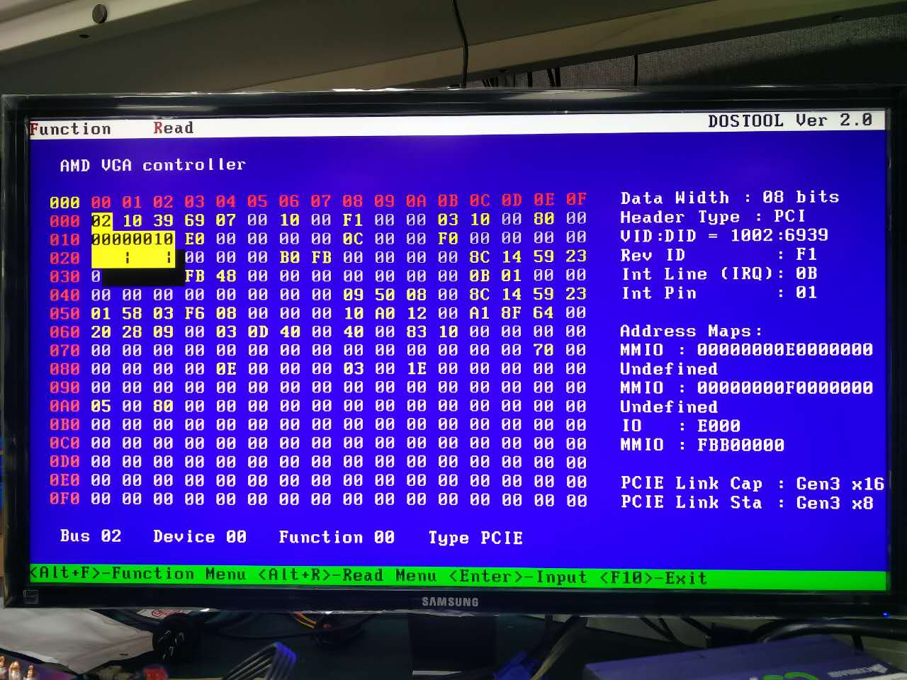

DOSTOOL
=======

DOSTOOL is a working-in-DOS X86 architechture hardware information obtaining tool. The origin purpose was for system validation auxiliary. Functional functions could also help learning X86 architecture.

Notice and Contact Information
------------------------------

1. DOSTOOL is not a product, and it does not have a full-time support team.

2. So far, DOSTOOL only support Intel and VIA X86 architechture CPU & chipset;
   Because of BIOS, DOSTOOL cannot work well on some specific mainboards;
   For example, DOSTOOL cannot read SPD information of ASUS X79.

3. To help DOSTOOL develop further, please report bug and consider feedback.

4. For other questions, contact lcx061125@163.com

Compiling & Usage
--------------------

Please refer to "User_Guide.docx" for details.

Express Gratitude
-----------------

South Huang, Marion Zhang, Jeff Zhao.

User Interface Presentation
---------------------------

